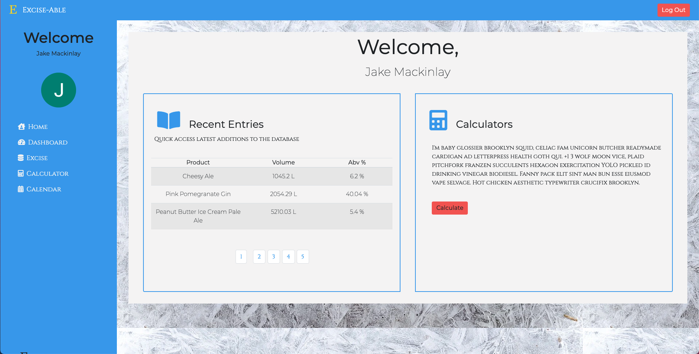

# Excise-able

## Table of Contents

* **[Description](#Description)**

* **[Installation](#Installation)**

* **[Constributions](#Contributions)**

* **[Testing](#Testing)**

* **[Questions](#Questions)**

### Description

An excise logging, tracking and calculating application using the MERN stack.

Deplyed Link: [https://excise-able.herokuapp.com/](https://excise-able.herokuapp.com/)

### Installation

Fork or copy repo, in the root directory console run "npm install" and navigate to the client directory and do the same

### Constributions

None

### Testing

None

### Questions

**Any questions please contact me either [here](https://github.com/tallglassof-milkjake) or at jrmackinlay90@gmail.com
